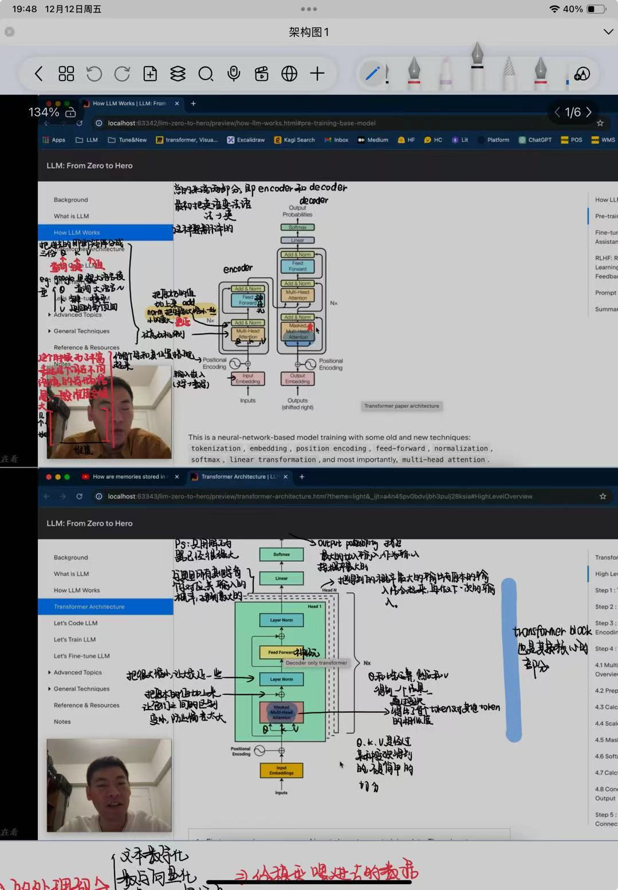
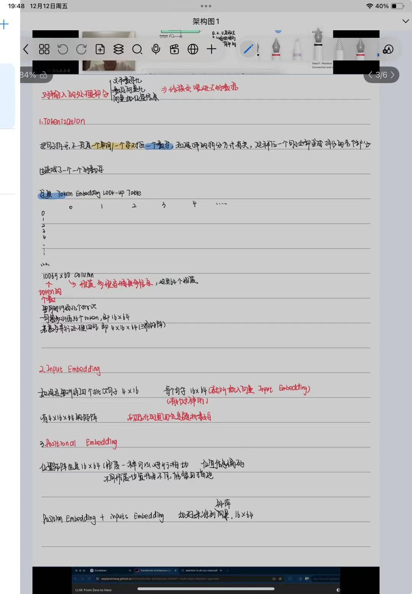
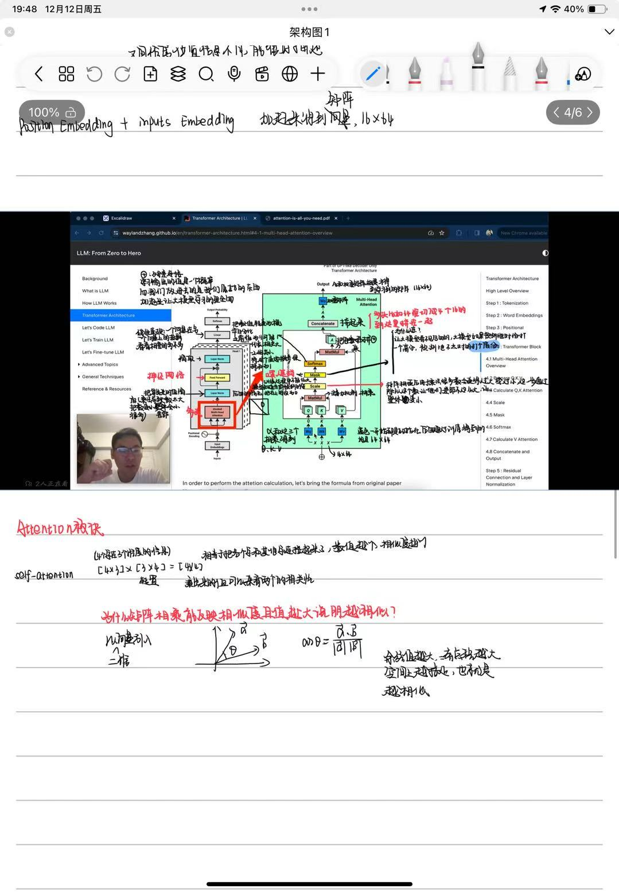
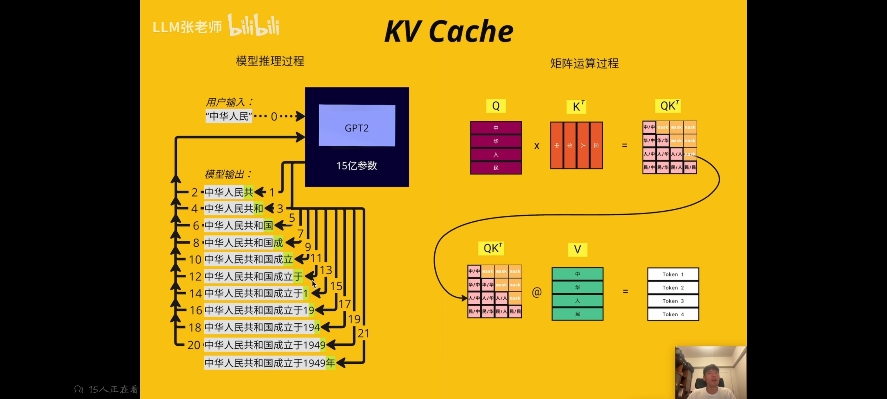
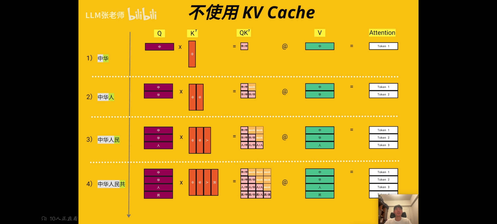
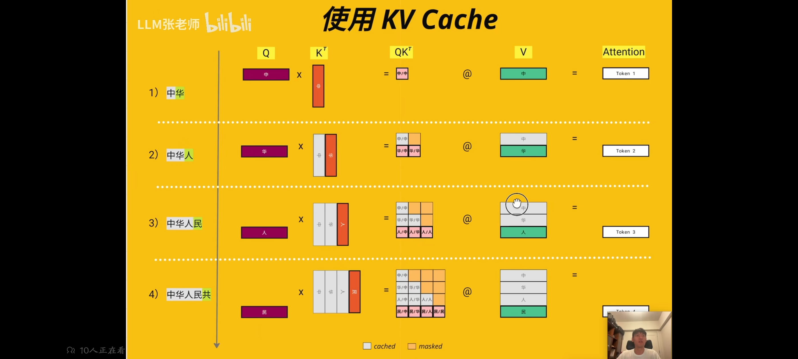
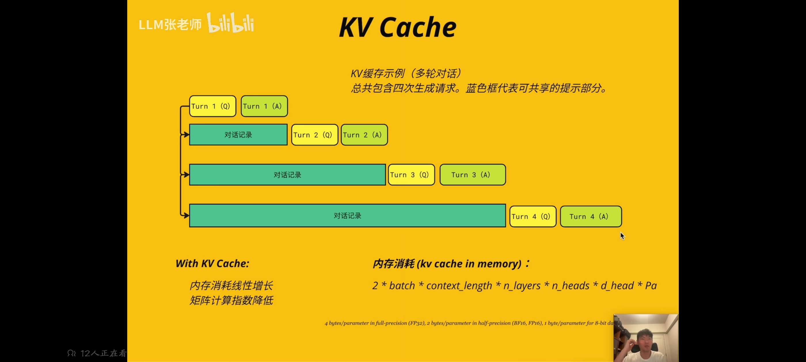
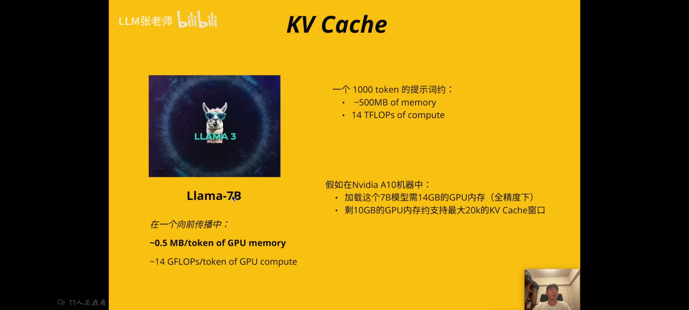
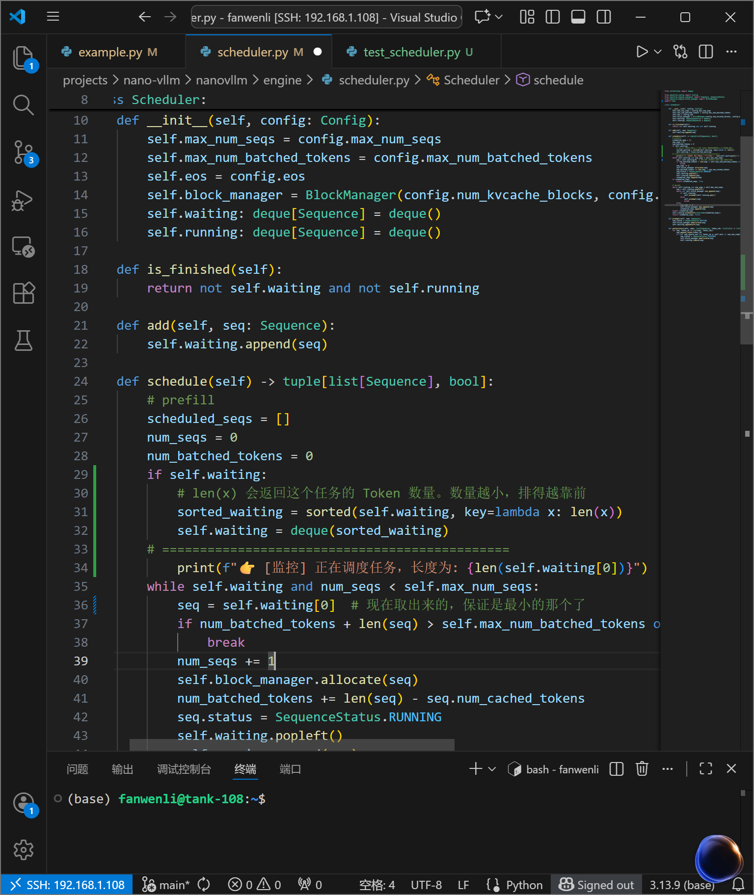
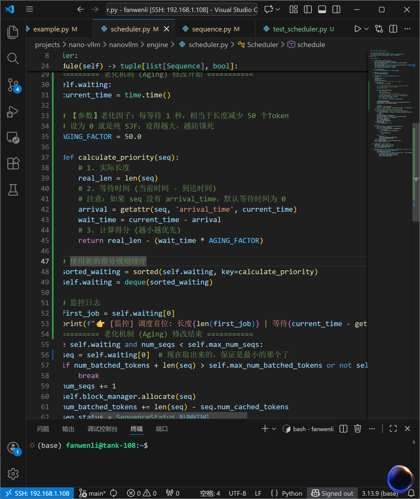

# 首先明确，KVcache是用于transformer中的attention模块，来加快计算QKV的过程。普通的直接进行矩阵运算，因此这里先补充一下attention的知识。




## KVcache具体
1. KVcache主要应用于推理阶段，不是训练阶段（KV不变）
2. 只存在解码器里面
3. 目的：加速计算QKV的过程（两次矩阵相乘的速度）
4. 会加大内存占用（有如此多的缓存）
5.
   如图，attention的大概原理就是QK相乘以后变成概率的矩阵，然后和V相乘，得到结果。Q的上下之间是token的个数，左右是其维度（往往是分了头以后的，大概五百多），所有的优化都是在中间那个正方形矩阵那里进行优化的
6. 
        每次都要重复计算前面公共的，如果能把之前算过的存储起来，能大大加快计算速度（右上角mask的值是为了避免大模型在预测计算的时候能看见后面的东西）
7.  

不使用的时候是这个情况，每次都会重复的算同样的值

之前是每次都计算重复，现在把前一步的结果cache住，每一步得到一个结果，就保存一个结果，下次用到的时候就直接从缓存中取，省了重复计算。cache不是在保存一个矩阵，而是向量，让向量进行运算，cache的是灰色部分。Q每次新加的是上一个的计算结果，因此不用缓存，K和V是需要的

大模型在回答我们的问题的时候，不是每个问题都毫无关联，而是会综合我们上一轮的问题和答案，最后得出一个综合结果。如果上下文达到很长的长度，那KVcache就达到极限了，他能记忆的长度是有限的。！！！！也就是为什么会出现问大模型问题问的上下文太多的时候，出现他忘记了前面的东西的情况。KVcache加快了我们的计算速度，因为我们把很多东西放在内存里了，但是我们牺牲了内存，换来了计算速度。     如图内存消耗个数，2(KV两个矩阵)×并行的批次×上下文长度×层数×多少个头×每个头的维度×精度，算出来内存占用率
8. 内存占用的是很大的，以下图为例子

一个token占用0.5MB的GPU内存，占用14G的计算量，1000个token占用500MB，计算量14T的浮点数运算，所以随着KVcache的发展，计算速度很快，通过GPU并行等达到了很快的速度
9. KVcache是一种比较早的优化，后面有一些通过降低精度等来实现减小内存，后面的很多优化大概也是基于这个原理
## 接下来用猪脑子浅看一下代码
```python
# ========================================================
# TODO 1: Prefill 阶段
# ========================================================
# 这里的 input_tensor 是整句话，例如 "Hello world"
logits, past_kvs = model(input_tensor, past_kvs=None, use_cache=True)

# 从 prefill 输出中选择下一个 token
next_id = torch.argmax(logits[0, -1, :]).item()
generated.append(next_id)
```
详细分析：

输入 (input_tensor)：是一个完整的序列，形状是 [1, seq_len]（例如 [1, 2] 代表 "Hello world"）。

past_kvs=None：因为是刚开始，没有任何历史记忆（缓存）。

计算过程：

GPT2 并行计算所有 Token 的 Attention。

它算出了 "Hello" 和 "world" 对应的 Key (K) 和 Value (V) 矩阵。

输出：

logits：预测结果。我们只关心最后一个位置 logits[0, -1, :]，因为它代表根据 "Hello world" 预测的下一个词（比如 "!"）。

past_kvs：这是重点！ 模型把它计算好的 "Hello" 和 "world" 的 K 和 V 矩阵打包返还给你了。这就相当于它把“笔记”交到了你手里。
```python 
# ========================================================
# TODO 2: Decode 阶段
# ========================================================
for _ in tqdm(range(n_tokens_to_generate - 1), desc="generating"):
    
    # 1. 准备输入：只有刚刚生成的那个新字！
    # 形状是 [1, 1]，而不是越来越长的 [1, N]
    next_input = torch.tensor([[next_id]], device=device) 

    # 2. 调用模型：带着“笔记” (past_kvs) 进去
    logits, past_kvs = model(next_input, past_kvs=past_kvs, use_cache=True)
    
    # 3. 选择下一个 token
    next_id = torch.argmax(logits[0, -1, :]).item()
    generated.append(next_id)
```
详细分析：

输入 (next_input)：注意这里，输入长度永远是 1。无论你之前生成了 50 个字还是 500 个字，我们要算的输入只是刚刚生出来的那个词（比如 "!"）。

past_kvs=past_kvs：你把上一轮拿到手里的“笔记”（包含 "Hello", "world" 的 K/V）又传回给模型。

模型内部发生了什么？

模型只计算新词 "!" 的 Query (Q), Key (K), Value (V)。

它不需要重新计算 "Hello" 和 "world" 的 K 和 V。

它拿 "!" 的 Q，去和缓存里的 K 做点积（Attention），这就完成了“回顾历史”。

最后，模型把 "!" 的 K 和 V 拼接到 past_kvs 里。

输出更新：

新的 past_kvs 变大了，里面现在包含了 "Hello", "world", "!" 三个词的信息，准备传给下一轮。

# nano-vllm
## vllm
可以比直接调用模型的generate速度快24倍
前面讲了KVcache提高了计算速度，但是浪费了大量的内存。
### 名字
1. 核心致敬对象：vLLM
这个项目的“本体”是业界大名鼎鼎的开源项目 vLLM。

vLLM 是什么？ 它是目前 AI 圈最火、最主流的大模型推理加速库（Inference Engine）。你现在用的 ChatGPT、Kimi 或者是很多公司的后台服务，底层大概率都用到了 vLLM 或者类似的各种变体。

"v" 的含义： 这里的 v 通常被认为代表 Velocity（速度）或者 Virtual（虚拟）。

它最牛的技术叫 PagedAttention。

这个技术是从操作系统（OS）里抄来的。它把显存像操作系统的“虚拟内存”一样分页管理，彻底解决了显存浪费的问题。这也是为什么你们这次作业要做调度和显存管理，因为这是 vLLM 的灵魂。

2. 前缀修饰：Nano (纳诺)
在计算机界，叫 Nano 的东西通常有以下特点：

含义：微小的、极简的。

目的：教学专用 (Educational)。

解释：真正的 vLLM 是一个工业级的巨无霸，里面有几万行复杂的 C++ 和 CUDA 代码，初学者进去看一眼就晕了，根本没法做作业。

Nano-vLLM：就是把那个巨无霸 vLLM 删繁就简，剔除了复杂的分布式计算、各种硬件兼容，只保留最核心的 Python 逻辑（比如调度器、块管理）。

1. 大模型不知道会生成多少给token
2. 生成第一个的时候后面的空间已经分配好了，本来可以并行处理，但是现在因为预分配大大减慢效率
3. 碎片（祭祖课）
vllm就是来解决这个浪费问题的！！（让能够并行处理的batch（批次）变大，提高吞吐量，也让单位时间内输出变多），做的优化如下：
1. Page Attention

操作系统里面把物理内存分为很多个不同的页，然后进行映射，来提高利用率，所以这里KVcache也按照KVblock的大小进行分开，然后进行映射，这样本来是相邻的token映射以后也不需要非得连着，有可能也在不同的块里面了，而且这样以块为单位，就算浪费也只会浪费三个，不会像以前一样浪费那么多


通过这种把逻辑显存映射到物理显存的方式，让原本需要紧挨在一起的变得可以分开，而且让程序感觉自己用的是一整片连续的空间。vllm通过管理这个表，就可以完成映射了
2. Sharing KV Blocks
 
 
## 代码实现总结
核心任务：调度算法 (Scheduling)
本次作业的目标是将默认的 FCFS (先来后到) 调度改为 SJF (短作业优先)。

1. 理论对比
FCFS (First-Come First-Served):

逻辑：谁先排队谁先吃。

缺点：如果有长任务（大作业）排在前面，后面所有短任务都要等很久（护航效应）。

SJF (Shortest Job First):

逻辑：不管谁先来，队列里谁的任务最短（Token 最少），谁先吃。

优点：大幅降低平均等待时间。

缺点：饥饿 (Starvation)。如果短任务源源不断，长任务可能永远轮不到执行。！！！！！刚好上课讲了
以下为单纯根据长短来排序的实现方式：

以下是为了避免“饥饿”情况的产生，引入时间老化因子的相关计算公式来根据得分排序的实现方式：


