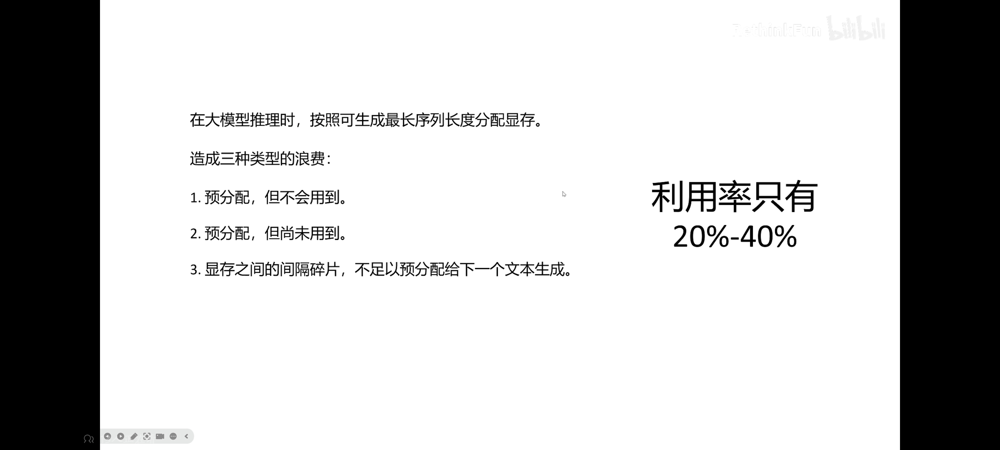
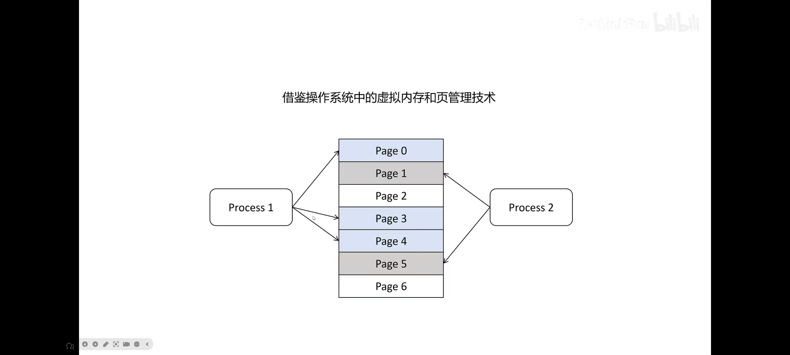
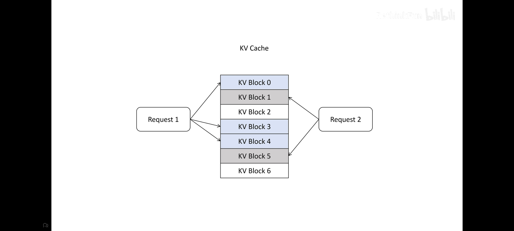
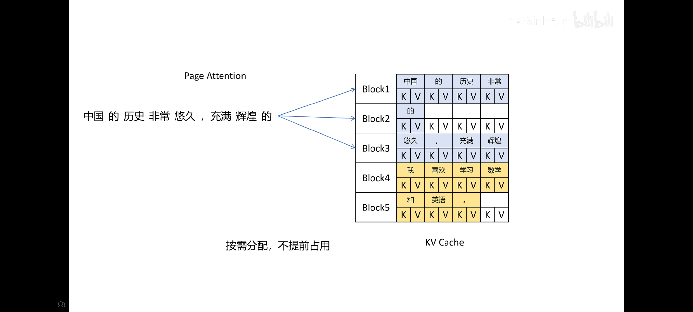
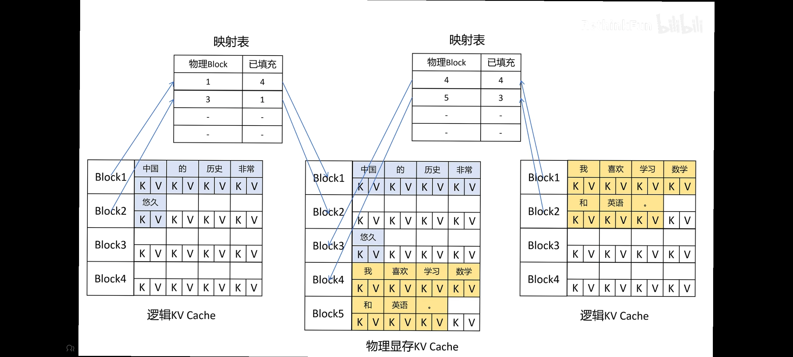
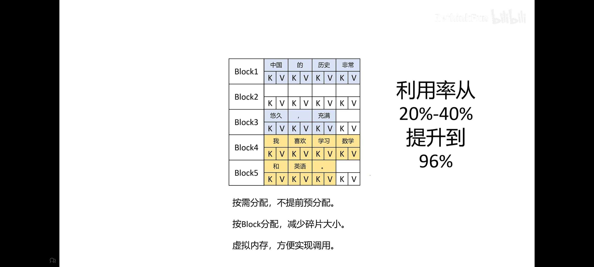
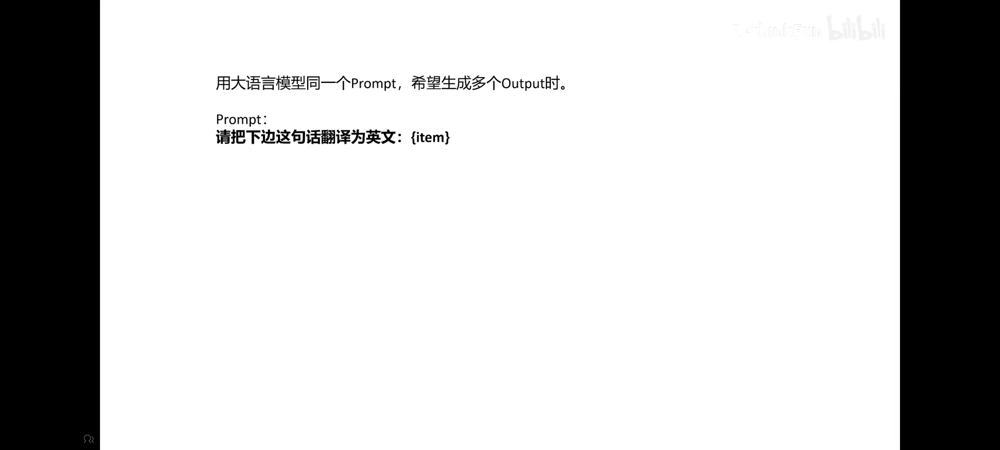
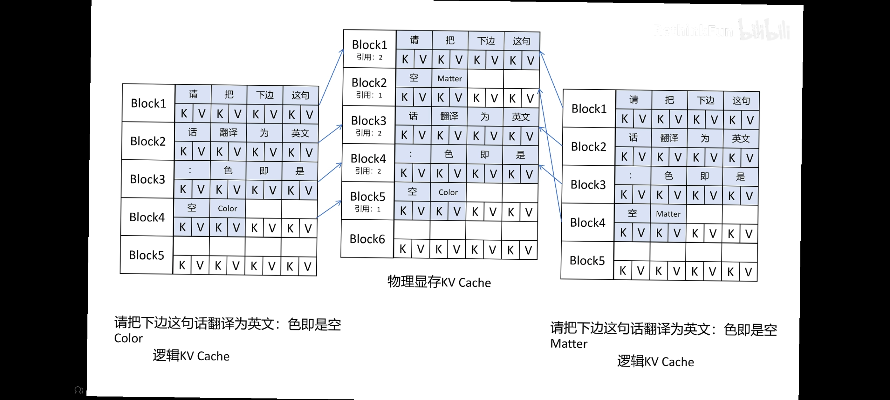

# nano-vllm
## vllm
可以比直接调用模型的generate速度快24倍
前面讲了KVcache提高了计算速度，但是浪费了大量的内存。

1. 大模型不知道会生成多少给token
2. 生成第一个的时候后面的空间已经分配好了，本来可以并行处理，但是现在因为预分配大大减慢效率
3. 碎片（祭祖课）
vllm就是来解决这个浪费问题的！！（让能够并行处理的batch（批次）变大，提高吞吐量，也让单位时间内输出变多），做的优化如下：
1. Page Attention

操作系统里面把物理内存分为很多个不同的页，然后进行映射，来提高利用率，所以这里KVcache也按照KVblock的大小进行分开，然后进行映射，这样本来是相邻的token映射以后也不需要非得连着，有可能也在不同的块里面了，而且这样以块为单位，就算浪费也只会浪费三个，不会像以前一样浪费那么多




通过这种把逻辑显存映射到物理显存的方式，让原本需要紧挨在一起的变得可以分开，而且让程序感觉自己用的是一整片连续的空间。vllm通过管理这个表，就可以完成映射了
2. Sharing KV Blocks
 
 
## 代码实现总结
核心任务：调度算法 (Scheduling)
本次作业的目标是将默认的 FCFS (先来后到) 调度改为 SJF (短作业优先)。

1. 理论对比
FCFS (First-Come First-Served):

逻辑：谁先排队谁先吃。

缺点：如果有长任务（大作业）排在前面，后面所有短任务都要等很久（护航效应）。

SJF (Shortest Job First):

逻辑：不管谁先来，队列里谁的任务最短（Token 最少），谁先吃。

优点：大幅降低平均等待时间。

缺点：饥饿 (Starvation)。如果短任务源源不断，长任务可能永远轮不到执行。
```python
def schedule(self) -> tuple[list[Sequence], bool]:
        # prefill
        scheduled_seqs = []
        num_seqs = 0
        num_batched_tokens = 0

        # =========== SJF 核心修改代码 ===========
        if self.waiting:
            # 1. 排序：按 Prompt 长度 (len(x)) 从小到大排序
            # 这样短任务就会跑到队伍最前面 (索引0)
            sorted_waiting = sorted(self.waiting, key=lambda x: len(x))
            
            # 2. 更新队列：把排好序的列表变回 deque
            self.waiting = deque(sorted_waiting)
            
            # (可选) 调试打印，用于验证长短顺序
            # print(f"👉 [监控] 正在调度任务，长度为: {len(self.waiting[0])}")
        # ======================================

        while self.waiting and num_seqs < self.max_num_seqs:
            # ... 原有逻辑不变 ... ```
我们编写了一个测试脚本，故意先提交长任务，再提交短任务，观察系统是否会自动“插队”。虽然长度为 7 的任务是第 2 个提交的，但它第 1 个被处理。证明 SJF 成功生效。

##
参数,含义,通俗理解
max_num_batched_tokens,最大批处理 Token 数,桌子的最大承重，一次不能端太多盘子。
max_num_seqs,最大并发序列数,餐厅的座位数，坐满了就不让进人了。
gpu_memory_utilization,显存占用率 (0.9),霸道模式，启动时直接圈占 90% 显存。
kvcache_block_size,KV Cache 块大小,显存分页的“页大小”，PagedAttention 的基础。
2. Eager Mode vs CUDA Graph
作业中使用了 enforce_eager=True。

Eager Mode (强制开启)：一步一动，解释执行。

优点：灵活，支持变长数据（适合 SJF 这种乱序场景），方便调试。

缺点：稍微慢一点点。

CUDA Graph：提前录制，整图执行。

特点：极快，但要求输入形状固定。因为 SJF 导致每次进来的任务数量和形状不固定，所以本次作业不适合用它。